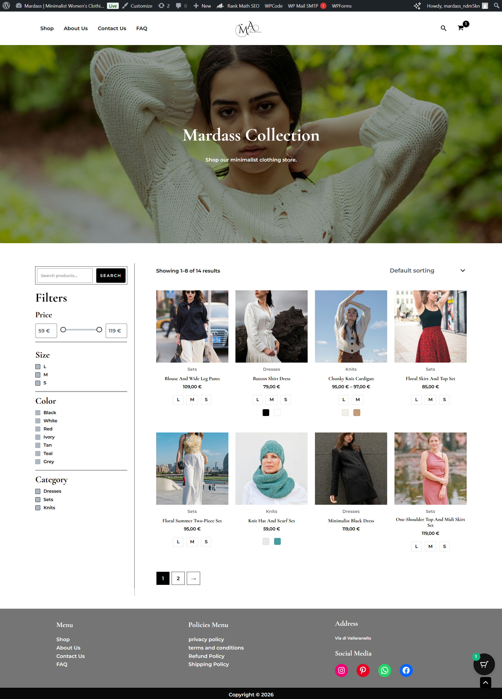
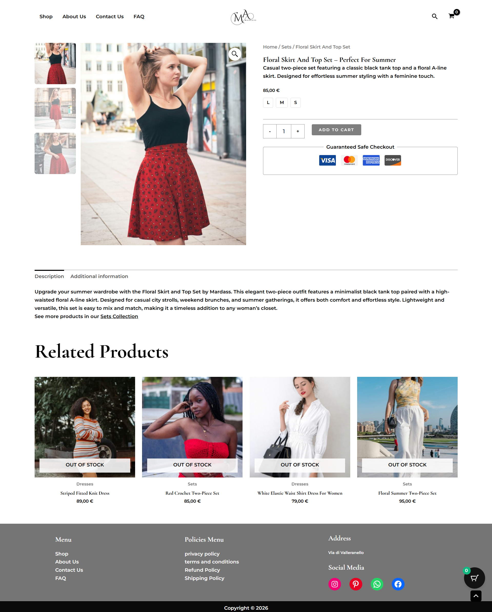

# Mardass – WooCommerce Store

A fashion e-commerce website built with WordPress and WooCommerce.

---

## Project Status

🚧 In Progress

---

## Overview

This project documents the process of building and configuring a WooCommerce online store, focusing on security, structure, and practical implementation.

---

## Completed So Far

- Clean WordPress installation
- WooCommerce setup
- Security configuration with Wordfence (brute force protection, 2FA, firewall rules, CAPTCHA enabled)
- Structured product data architecture (SKU system, category structure, variable product logic)
- CSV-based product import
- SEO-oriented product naming strategy
- Stock management per variation

---

## 🛍️ Single Product Page Customization

The default WooCommerce product gallery layout was redesigned using pure CSS (Flexbox), without modifying any PHP files.

Key improvements:

- Repositioned product thumbnails to the side of the main image (desktop & tablet)
- Implemented a flexible layout using `display: flex`
- Improved visual hierarchy between main image and gallery thumbnails
- Added hover effects (opacity and scale) for better user interaction
- Optimized spacing and alignment for a cleaner UI

Responsive adjustments:

- On mobile devices, the layout switches to a vertical structure
- Thumbnails are displayed horizontally with proper spacing
- Ensured full responsiveness across different breakpoints

---

## Tech Stack

- WordPress
- WooCommerce
- Wordfence Security
- WooCommerce CSV Import System

---

## Documentation

- [Setup Guide](setup-guide/installation.md)
- [Architecture](architecture/project-structure.md)
- [Security Details](security/security-notes.md)
- [Performance Notes](performance/optimization-notes.md)
- [Product Structure](product-structure/product-architecture.md)

---

## Live Demo

https://www.mardass.com/

---

## Notes

This project focuses on a practical WooCommerce implementation rather than custom backend development.

## 📸 Screenshots

### 🏠 Homepage

---

### 🛍️ Shop Page

---

### 📦 Product Page

---

### 📄 Other Pages

- [About Page](screenshots/about.png)
- [Contact Page](screenshots/contact.png)
- [FAQ Page](screenshots/faq.png)
- [Privacy Policy](screenshots/privacy-policy.png)
- [Terms & Conditions](screenshots/terms-and-conditions.png)
- [Refund Policy](screenshots/refund-policy.png)
- [Shipping Policy](screenshots/shipping-policy.png)
